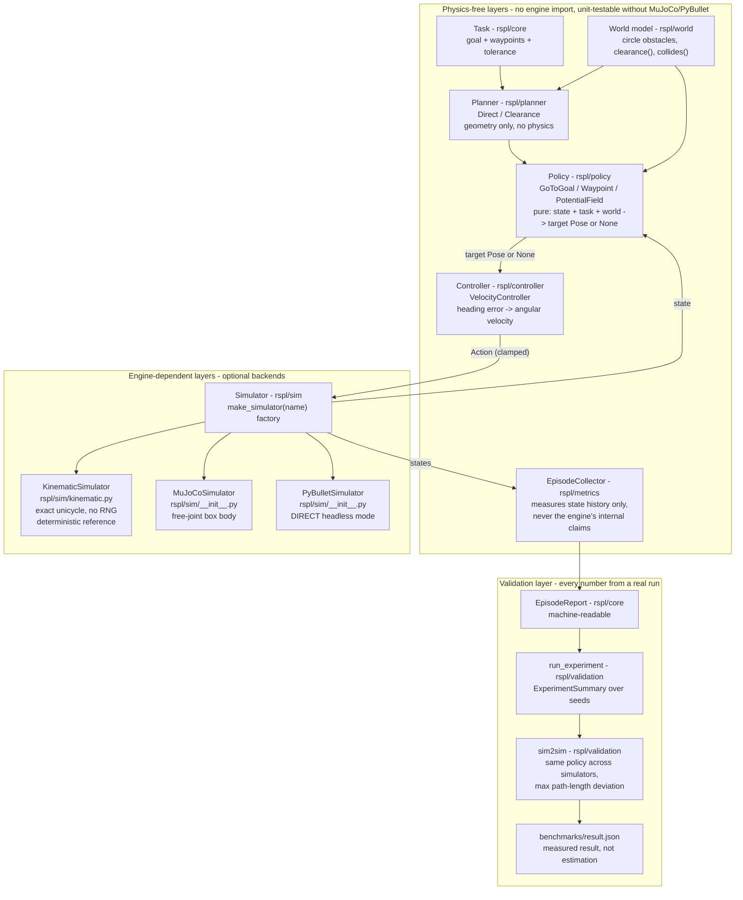

# Architecture

## Layering

```
Task
  │
  ▼
Policy ──────────▶ target pose
  │
  ▼
Controller ─────▶ Action (linear, angular velocity)
  │
  ▼
Simulator ──────▶ State (pose, velocities, contact)
  │
  ▼
Metrics ────────▶ EpisodeReport
  │
  ▼
Validation ─────▶ ExperimentSummary / sim2sim report
```

## Invariants

- **Policy/planner/controller/metrics are pure** — no physics imports, fully
  unit-testable without any engine.
- **Simulators are interchangeable** — `reset()`, `step(action) -> State`,
  `state` and `name` are the entire contract.
- **Metrics are backend-agnostic** — derived from the state history alone, so
  comparing backends is meaningful.
- **Determinism** — the only randomness is the per-seed goal jitter; the same
  seed yields the same report on the same backend.

## Why three backends

| Backend | Motion model | Contact model | Value |
| --- | --- | --- | --- |
| `kinematic` | exact unicycle | analytic circles | reference, fast, portable |
| `mujoco` | MuJoCo free-joint integration | MuJoCo solver | real physics, reproducible |
| `pybullet` | Bullet rigid-body | Bullet contact | real physics, independent |

The kinematic backend is the **reference**. Physics backends are real — their
numbers can and do differ, and sim-to-sim exists to *measure* that difference.

## Diagram

Source: [diagrams/robotics-policy-lab.mmd](diagrams/robotics-policy-lab.mmd)
(rendered inline for GitHub; edit the `.mmd`, regenerate with `mmdc`).



## Evidence map (diagram -> code)

| Component | Module | What it proves | Evidence |
| --- | --- | --- | --- |
| Planner | `rspl/planner/__init__.py` | geometry-only waypoints, no physics imports | `tests/test_pure.py` |
| Policy | `rspl/policy/__init__.py` | pure, deterministic target selection | `tests/test_pure.py` |
| Controller | `rspl/controller/__init__.py` | bounded velocity commands | `tests/test_pure.py` |
| Kinematic backend | `rspl/sim/kinematic.py` | exact unicycle reference, no engine, no RNG | `tests/test_pure.py` |
| MuJoCo / PyBullet | `rspl/sim/__init__.py` | real integrators behind the same contract | `tests/test_physics.py` |
| EpisodeCollector | `rspl/metrics/__init__.py` | metrics from state history only | `tests/test_experiment.py` |
| sim2sim | `rspl/validation/__init__.py` | measures cross-engine deviation, treats it as data | `tests/test_experiment.py` + `benchmarks/result.json` |

## See also

- [Methodology](methodology.md)
- [Validation](validation.md)
